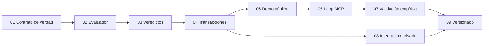

# Plan maestro — demostrar que `felix_felicis` funciona

El objetivo no es completar toda la visión antes de recibir evidencia. El
objetivo es demostrar, por capas, que Felix representa conocimiento sin
pérdida, detecta contradicciones formales, explica sus rechazos y mejora el
resultado de un agente en escenarios reproducibles.

## Estado global

| Campo | Valor |
|---|---|
| Estado | pendiente |
| Versión de partida | `v0.1.0` |
| Próximo gate | `v0.2.0` |
| Progreso | 0/9 fases completas |
| Última actualización | 2026-09-21 |

Estados admitidos: `pendiente`, `en curso`, `bloqueado`, `completo`. Una fase
solo pasa a `completo` cuando cumple todos sus criterios de aceptación y deja
evidencia reproducible en su registro.

## Qué significa «funciona»

| Afirmación | Evidencia requerida |
|---|---|
| La representación es fiel | Carga, serialización y recarga conservan átomos y anexos. |
| El check es correcto | Un evaluador de referencia coincide con un corpus etiquetado y pruebas generativas. |
| El rechazo es explicable | Cada contradicción devuelve un testigo mínimo por inclusión. |
| La operación es segura | Un candidato rechazado no modifica el universo persistido. |
| El sistema ayuda | Un agente con Felix mejora frente al mismo agente sin Felix en una evaluación pareada. |

## Ruta crítica

## Fases

| # | Fase | Estado | Depende de | Resultado observable |
|---|---|---|---|---|
| [01](01-contrato-de-verdad.md) | Contrato de verdad | pendiente | — | `validate` y `check` significan cosas distintas y verificables. |
| [02](02-evaluador-de-referencia.md) | Evaluador de referencia | pendiente | 01 | Toda fórmula admitida tiene semántica ejecutable. |
| [03](03-veredictos-explicables.md) | Veredictos explicables | pendiente | 02 | Los rechazos traen testigos; las ausencias, prescripciones. |
| [04](04-operacion-transaccional.md) | Operación transaccional | pendiente | 03 | Ningún rechazo modifica el estado vigente. |
| [05](05-demo-publica.md) | Demo pública | pendiente | 01–04 | Una contradicción y su reparación se reproducen con un comando. |
| [06](06-loop-de-agentes-mcp.md) | Loop de agentes por MCP | pendiente | 05 | Un agente propone, recibe veredicto, corrige y readmite. |
| [07](07-validacion-empirica.md) | Validación empírica | pendiente | 05–06 | Hay mediciones públicas de corrección, utilidad y costo. |
| [08](08-integracion-privada.md) | Integración privada | pendiente | 04 | El bundle real valida el motor sin filtrarse al repositorio público. |
| [09](09-versionado-y-evidencia.md) | Versionado y evidencia | pendiente | 07–08 | Cada tag corresponde a capacidades demostradas y CI verde. |

## Reglas de progreso

- Cada fase se implementa en una rama `codex/<fase>` o equivalente.
- Cada cambio conserva pruebas y documentación junto al comportamiento.
- Ninguna casilla se marca por intención; se marca con un commit, prueba o
  artefacto enlazado en el registro de evidencia.
- Un bloqueo explica qué falta, quién puede resolverlo y qué trabajo puede
  continuar sin esa decisión.
- Las mediciones se publican aunque contradigan la hipótesis del proyecto.
- Revisión AGM, recuperación avanzada y DPO/SqPO quedan fuera hasta que la
  demo mínima pruebe valor.

## Checklist maestro

- [ ] 01 — El contrato público distingue estructura de semántica.
- [ ] 02 — El evaluador de referencia ejecuta todo el AST soportado.
- [ ] 03 — Los veredictos explican contradicciones y vacíos.
- [ ] 04 — Las propuestas son transaccionales.
- [ ] 05 — La demo pública corre en CI.
- [ ] 06 — El loop MCP funciona de extremo a extremo.
- [ ] 07 — La evaluación comparativa tiene resultados publicados.
- [ ] 08 — La integración privada pasa sin exponer datos.
- [ ] 09 — Se publica el tag correspondiente con evidencia enlazada.

## Próximo paso

Abrir la fase [01 — Contrato de verdad](01-contrato-de-verdad.md), fijar los
nombres de comandos, sus códigos de salida y la forma estable del resultado.
